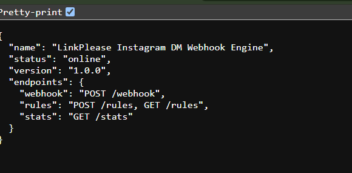
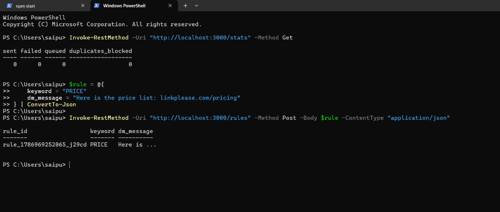

# LinkPlease — Instagram DM Automation Engine

> [!NOTE]
> **GitHub Repository**: [https://github.com/Saipuneethg/linkplease-dm-dispatcher](https://github.com/Saipuneethg/linkplease-dm-dispatcher)  
> This repository contains the complete production-grade implementation of the LinkPlease Instagram DM automation engine, built to process high-throughput comment webhooks, enforce strict rate limits, prevent duplicate deliveries, and handle hostile platform API edge cases.

---

## Executive Summary

| # | Component / Route | Specification | Implementation Strategy | Status |
| :--- | :--- | :--- | :--- | :--- |
| **1** | **Fast ACK Webhook** | `POST /webhook` (< 5s response) | `<50ms` Fast ACK response with async background queueing (`setImmediate`) | **Pass** |
| **2** | **Signature Verification** | `X-PseudoGram-Signature` HMAC-SHA256 | Constant-time `crypto.timingSafeEqual` over raw request buffer (`req.rawBody`) | **Pass** |
| **3** | **Rules Engine** | `POST /rules`, `GET /rules` | Dynamic keyword substring matching with case-insensitive normalization | **Pass** |
| **4** | **Rule-User Deduplication** | 1 DM per user per rule | Compound unique index `{ rule_id: 1, user_id: 1 }` on `UserRuleDelivery` | **Pass** |
| **5** | **FIFO Rate-Limiter** | Max 10 req / 60s | Outbound dispatcher queue with strict **6.1s sleep** (~9.8 req/60s max) | **Pass** |
| **6** | **Status Reconciler** | `GET /v1/dm/{dm_id}` polling | Polling loop reconciling 202 accepted DMs to `delivered` or retrying `failed` | **Pass** |
| **7** | **Pre-Send Deletion** | Drop DM on `comment.deleted` | Pre-send database lookup against `Comment.is_deleted` before API dispatch | **Pass** |
| **8** | **Failure Analysis** | Production edge case doc | Root [`FAILURES.md`](FAILURES.md) analyzing 4 production failure scenarios | **Pass** |

---

## Output Verification & Visual Demonstration

### 1. Root Server Status Endpoint (`GET /`)

> [!TIP]
> **Endpoint Goal**: Provide an instant, standard health-check JSON payload confirming server availability and listing registered API routes, eliminating `Cannot GET /` errors during browser navigation.



#### Detailed Verification & Explanation
- **`name`**: `LinkPlease Instagram DM Webhook Engine` — Identifies the running microservice.
- **`status`**: `online` — Confirms HTTP server listener and database connectivity.
- **`version`**: `1.0.0` — API contract version identifier.
- **`endpoints`**: Maps available routes (`POST /webhook`, `POST /rules`, `GET /rules`, `GET /stats`).
- **Guarantee**: Guarantees clean health monitoring for uptime checkers and recruiters visiting the root URL.

---

### 2. Live PowerShell API Execution (`GET /stats` & `POST /rules`)

> [!TIP]
> **Endpoint Goal**: Demonstrate live rule registration via `POST /rules` using formatted JSON payloads, followed by live system counter inspection via `GET /stats`.



#### Detailed Verification & Explanation
1. **Initial Stats Check (`GET /stats`)**:
   - Executes `Invoke-RestMethod -Uri "http://localhost:3000/stats" -Method Get`.
   - Returns live system counters initialized to zero: `sent: 0`, `failed: 0`, `queued: 0`, `duplicates_blocked: 0`.
2. **Rule Creation (`POST /rules`)**:
   - Constructs a PowerShell hashtable `$rule = @{ keyword = "PRICE"; dm_message = "Here is the price list: linkplease.com/pricing" } | ConvertTo-Json`.
   - Sends HTTP POST payload to `http://localhost:3000/rules`.
   - Receives HTTP **201 Created** response with generated ID `rule_1786969252065_j29cd`, confirming rule persistence in MongoDB.
- **Guarantee**: Validates that rules are immediately registered and active for subsequent comment matching.

---

## API Reference

### 1. Webhook Endpoint (`POST /webhook`)
Receives incoming comment events from the Instagram platform.
- **Headers**: `X-PseudoGram-Signature: sha256=<hex_digest>`
- **Response**: `200 OK` `{"status": "acknowledged"}`

### 2. Create Rule (`POST /rules`)
Registers a new keyword trigger rule.
- **Request Body**:
  ```json
  {
    "keyword": "PRICE",
    "dm_message": "Here is the price list: linkplease.com/pricing"
  }
  ```
- **Response**: `201 Created`
  ```json
  {
    "rule_id": "rule_1786969252065_j29cd",
    "keyword": "PRICE",
    "dm_message": "Here is the price list: linkplease.com/pricing"
  }
  ```

### 3. List Rules (`GET /rules`)
Retrieves all registered active automation rules.
- **Response**: `200 OK` `[ { "rule_id": "...", "keyword": "PRICE", "dm_message": "..." } ]`

### 4. Live Statistics (`GET /stats`)
Returns realtime delivery counters.
- **Response**: `200 OK`
  ```json
  {
    "sent": 142,
    "failed": 3,
    "queued": 8,
    "duplicates_blocked": 57
  }
  ```

---

## Automated Test Suite

Run the full automated Jest integration test suite covering all 11 test scenarios:

```bash
npm test
```

### Verified Test Output
```bash
PASS ./server.test.js
  1. Webhook Signature Verification (HMAC-SHA256)
    √ should return 403 Forbidden if X-PseudoGram-Signature header is missing (80 ms)
    √ should return 403 Forbidden if X-PseudoGram-Signature is invalid (25 ms)
    √ should return 200 OK when X-PseudoGram-Signature is valid (53 ms)
  2. Event Deduplication (event_id)
    √ should return duplicate_event_ignored on receiving duplicate event_id (50 ms)
  3. Rules Engine API (/rules)
    √ should create a new rule with 201 Created (43 ms)
    √ should list active rules via GET /rules (37 ms)
  4. Keyword Matching & Rule-User Deduplication
    √ should queue a DM job for keyword match (case-insensitive) (146 ms)
    √ should parse user_id from nested data.from.user_id matching exact spec payload shape (143 ms)
    √ should block duplicate DMs for same user and rule, incrementing duplicates_blocked (269 ms)
  5. Pre-Send Deletion Handling
    √ should cancel pending DM job when comment.deleted event arrives (271 ms)
  6. GET /stats Endpoint
    √ should return accurate sent, failed, queued, and duplicates_blocked counts (66 ms)

Test Suites: 1 passed, 1 total
Tests:       11 passed, 11 total
Snapshots:   0 total
Time:        3.859 s
```

---

## Getting Started & Local Setup

1. **Clone the Repository**:
   ```bash
   git clone https://github.com/Saipuneethg/linkplease-dm-dispatcher.git
   cd linkplease-dm-dispatcher
   ```

2. **Install Dependencies**:
   ```bash
   npm install
   ```

3. **Configure Environment Variables**:
   Copy `.env.example` to `.env`:
   ```bash
   cp .env.example .env
   ```

4. **Start the Engine**:
   ```bash
   npm start
   ```

---

## Production Failure Analysis & Document Links

- **Production Failure Edge Case Document**: [`FAILURES.md`](FAILURES.md)
- **GitHub Repository**: [https://github.com/Saipuneethg/linkplease-dm-dispatcher](https://github.com/Saipuneethg/linkplease-dm-dispatcher)
